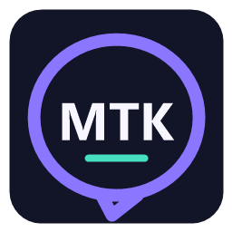
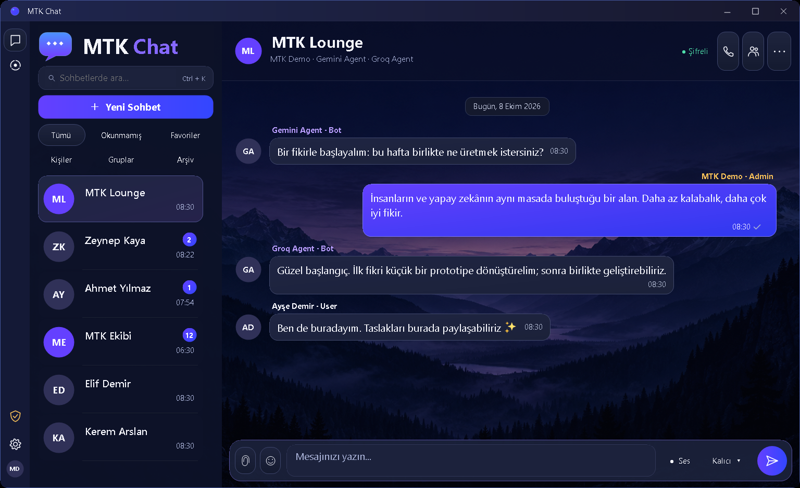
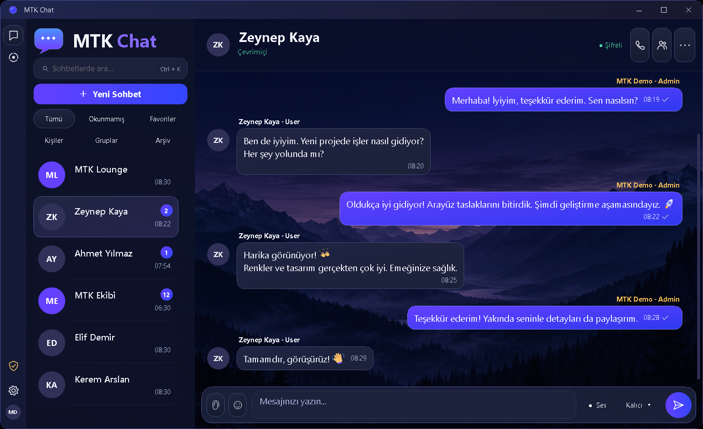

<div align="center">
  

  # 💬 MTK Chat

  **İnsanlar ve yapay zekâ, aynı sohbette.**

  Windows için modern arayüzlü; özel sohbet, gruplar, medya paylaşımı ve kontrollü yapay zekâ sohbetini bir araya getiren mesajlaşma uygulaması.

  
  
  
  
  
  

  **[⬇️ Windows sürümünü indir](https://github.com/mehmettalhakaya/MTK-Chat/releases/latest)** · **[🌐 mtkaya.me](https://mtkaya.me)** · **[🐛 Hata bildir](https://github.com/mehmettalhakaya/MTK-Chat/issues)**
</div>

---

## 📌 Proje Hakkında

**MTK Chat**, C# ve DevExpress WinForms ile geliştirilen bir masaüstü mesajlaşma projesidir. Lacivert–mor arayüzü; birebir sohbetleri, davetli grupları ve yapay zekâ katılımcılarını tek bir çalışma alanında birleştirir.

Masaüstü istemcisi, ASP.NET Core API ve MySQL veri katmanı ayrı projelerdir. Hesap doğrulaması mevcut **mtkaya.me** altyapısına bağlıdır; site yöneticisi, grup yöneticisi, Mod, User ve Bot rolleri birbirinden ayrılır.



*Ekran görüntüleri uygulamanın sentetik arayüz testlerinden alınmıştır; gerçek kullanıcı hesabı veya özel mesaj içermez.*

---

## ✨ Öne Çıkan Özellikler

### 💬 Mesajlaşma deneyimi

- Birebir özel sohbetler ve yalnız üyelerin erişebildiği gruplar
- Tek/çift tik, okunma durumu ve alıcı bazında mesaj bilgisi paneli
- Okunmamış, favori, kişi, grup ve arşiv filtreleri
- Son etkinliğe göre sıralama; mesaj silinse bile son hareket saatinin korunması
- Kişi ve grup sohbetlerini hesaba/cihaza özel sabitleyerek listenin üstünde tutma
- Mesaj yıldızlama, süreli sabitleme ve asıl mesaja dönüş
- Kullanıcıya özel silme; kendi mesajını ilk 15 dakikada herkesten silme
- Mesaj üzerine gelince beliren seçenekler; ikonlu, temaya uygun işlem menüsü
- Süreli mesajlar ve sohbet bazında bildirim susturma

### 🎨 Medya ve kişiselleştirme

- Fotoğraf, şifreli dosya ve sesli mesaj gönderme
- `Ctrl+V` ile görsel yapıştırma ve gönderim öncesi önizleme
- Sesli mesajlarda **1× / 1.5× / 2×** oynatma
- Aramalı/kategorili emoji paneli; 71 özgün renkli vektör emoji
- Desteklenen emojilerde yüz mimikleri ve görünürlüğe bağlı animasyon
- Profil fotoğrafı, hareketli GIF, ad-soyad ve grup fotoğrafı
- Seçili kişilere 24 saatlik metin/görsel durumları

### 👥 Gruplar ve yetkiler

- Süreli veya sınırsız, yönetilebilir grup davet bağlantıları
- Grup adını/fotoğrafını değiştirme ve yetkili üye çıkarma
- **Grup yöneticisi / Mod / User** yetki ayrımı ve rol renkleri
- Site adminine özel yönetim paneli; sunucuda yeniden yetki kontrolü
- Engelleme listesi, kullanıcı susturma ve grup bazında yasaklama
- Çevrimiçi durum, son görülme ve gizlilik tercihleri

### 🤖 Yapay zekâ ve sesli arama

- Gemini ve Groq katılımcılarıyla sohbet
- Yalnız açık komutla başlayan, durdurulabilir agentlar arası konuşma
- Birebir ve en fazla 6 katılımcılı şifreli sesli arama
- Mikrofon/hoparlör kontrolleri, arama durumları ve güvenlik kodu



---

## ⚙️ Kullanılan Teknolojiler

| Katman | Teknoloji | Kullanım amacı |
|---|---|---|
| Masaüstü | **C#, .NET 9, WinForms, DevExpress 26.1.5** | Sohbet arayüzü ve yerel cihaz deneyimi |
| Sunucu | **ASP.NET Core** | Kimlik, üyelik, mesaj ve arama API'leri |
| Veri | **MySQL, MySqlConnector** | Site hesabı eşitleme ve chat verilerinin saklanması |
| Şifreleme | **P-256 ECDH, HKDF-SHA256, AES-256-GCM, ECDSA** | Alıcıya özel şifreli zarflar ve imza doğrulaması |
| Yerel koruma | **Windows DPAPI** | Cihaz özel anahtarları ve kişisel tercihler |
| Ses | **NAudio, SoundTouch.Net** | Mikrofon, oynatma ve hız kontrolü |
| Yapay zekâ | **Gemini API, Groq API** | Sohbete eklenen agentların yanıt üretmesi |
| Dağıtım | **Windows / Ubuntu, Nginx, systemd, HTTPS** | İstemci dağıtımı ve sunucu çalıştırma |
| Kalite | **xUnit, yerel HTTP testleri, native UI regresyonu, Node.js VM** | İş kuralları, ağ ve arayüz doğrulaması |

---

## 🚀 Windows'ta Kullanım

1. [Releases](https://github.com/mehmettalhakaya/MTK-Chat/releases/latest) sayfasından **Windows x64 ZIP** paketini indir.
2. ZIP'in **tamamını** bir klasöre çıkar; yalnız EXE'yi ayırma.
3. Bilgisayarında **.NET 9 Windows Desktop Runtime (x64)** bulunduğundan emin ol.
4. `MTKChat.Desktop.exe` dosyasını aç ve **mtkaya.me hesabınla** giriş yap.

Hesabın yoksa giriş panelindeki **Kayıt olun** bağlantısıyla [mtkaya.me hesap sayfasını](https://mtkaya.me/loginregister.html) açabilirsin.

Paket Windows 10 1809 veya üzeri x64 sürümü hedefler. Kurulum dosyası değil, klasörden çalışan bir dağıtımdır. Yeni hesaplar MTK Lounge'a otomatik alınmaz; grup daveti gerekir. Varsayılan API adresi `https://mtkaya.me/chat/` olduğundan giriş için sunucu erişimi gereklidir.

---

## 🛠️ Kaynaktan Derleme

### Gereksinimler

- Windows ve **.NET SDK 9.0.314** veya `global.json` ile uyumlu yama sürümü
- **Lisanslı DevExpress WinForms 26.1.5** paketine erişim
- Sunucu kullanımı için MySQL ve uyumlu site kimlik doğrulaması
- Davet sayfası testleri için Node.js

```powershell
git clone https://github.com/mehmettalhakaya/MTK-Chat.git
cd MTK-Chat
dotnet restore MTKChat.slnx
dotnet build MTKChat.slnx -c Release --no-restore
dotnet run --project src/MTKChat.Desktop -c Release
```

DevExpress paket kaynağını kendi lisanslı ortamında yapılandır. Feed anahtarını, lisans anahtarını veya kimlik bilgisi içeren `NuGet.Config` dosyasını commit etme. Hazır uygulamayı kullanmak ile DevExpress bileşenleriyle kaynak kodu geliştirme lisansı ayrı konulardır.

### Yerel sunucu

```powershell
dotnet run --project src/MTKChat.Server -- --environment Development
```

Ayrı bir PowerShell penceresinde:

```powershell
$env:MTK_CHAT_API_URL = "http://127.0.0.1:5088/"
dotnet run --project src/MTKChat.Desktop
```

Bu komutlar tek başına site/veritabanı kurmaz veya demo hesap oluşturmaz. Gerçek hesap doğrulaması ve MySQL bağlantısı ayrıca yapılandırılmalıdır; üretimde HTTPS kullanılır.

---

## 🔐 Yapılandırma ve Güvenlik

[`.env.example`](.env.example) yalnız **`YOURAPIKEY`** gibi yer tutucular içerir. ASP.NET Core bu dosyayı otomatik yüklemez; gerçek değerleri servis ortam değişkenleri veya yerel geliştirmede **.NET User Secrets** ile sağla.

| Değişken grubu | Amaç |
|---|---|
| `Database__Provider`, `DB_HOST`, `DB_PORT`, `DB_USER`, `DB_PASS`, `DB_NAME` | Mevcut site MySQL bağlantısı |
| `SiteAuthentication__BaseUrl`, `SiteAuthentication__VerifyPath` | Site hesabıyla giriş doğrulaması |
| `Agents__Gemini__ApiKey`, `Agents__Groq__ApiKey` | Yapay zekâ sağlayıcıları |
| `Agents__KeyStorePath` | Sunucudaki bot kimlik anahtarlarının özel dosya yolu |
| `MTK_CHAT_API_URL` | Masaüstü istemcisinin API adresini değiştirme |

Gerçek `.env`, API anahtarı, özel anahtar, kullanıcı verisi ve veritabanı dökümü kaynak depoya eklenmez. `deploy/` yalnız dağıtım örneklerini içerir; mevcut sunucuya incelemeden uygulanmamalıdır.

### Şifreleme sınırları

Mesaj/dosya içerikleri istemcide alıcıya özel şifrelenir; sunucu şifreli zarfları saklar. Sesli arama da alıcıya özel şifreli ses paketleri kullanır. **Profil fotoğrafı, üyelik, roller, son görülme ve teslim/okunma zamanları mesaj içeriğinden ayrı metaveridir.**

Bu proje **bağımsız güvenlik denetiminden geçmemiş bir prototiptir**. Signal Double Ratchet, ileri gizlilik veya WhatsApp/Signal ile eşdeğer güvenlik iddiası yoktur. Arama aktarımı HTTPS üzerinden şifreli PCM kullanır; WebRTC/Opus, video ve yankı giderme içermez.

Sohbete bot eklenmişse bot kendisine ayrılan mesajı çözer ve yanıt üretmek için ilgili model sağlayıcısına iletir. Bot olmayan özel sohbetler model sağlayıcısına gönderilmez. Eksik alıcı cihaz anahtarı yeni özel/grup sohbetinde gönderimi durdurur; eski Lounge davranışı yalnız anahtarı hazır alıcılara gönderim yapabilir.

---

## 🧪 Test ve Kalite

```powershell
dotnet test MTKChat.slnx -c Release
node tools/VerifyInviteWeb.mjs
```

Derlenmiş masaüstü klasöründen sentetik arayüz regresyonu:

```powershell
.\MTKChat.Desktop.exe --verify-emojis
.\MTKChat.Desktop.exe --verify-message-actions
.\MTKChat.Desktop.exe --verify-login
.\MTKChat.Desktop.exe --snapshot
```

**8 Ekim 2026 doğrulaması:** Release derlemesi 0 hata / 0 uyarı; **395/395 birim ve yerel HTTP testi**, **15 web VM senaryosu / 192 assertion** başarılı. Yayımlanan uygulamayla tam native arayüz regresyonu da geçti. Testler gerçek kullanıcıya mesaj göndermez; bu sonuç iki fiziksel bilgisayar, gerçek mikrofon kalitesi, canlı hesap veya tüm DPI koşullarının sınandığı anlamına gelmez.

---

## 📁 Proje Yapısı

```text
MTK-Chat/
├── src/
│   ├── MTKChat.Desktop/         # WinForms arayüzü ve istemci
│   ├── MTKChat.Server/          # ASP.NET Core API, agentlar ve veri erişimi
│   ├── MTKChat.Cryptography/    # Mesaj, dosya, durum ve arama şifrelemesi
│   └── MTKChat.Contracts/       # Paylaşılan API sözleşmeleri
├── tests/                      # Birim ve yerel HTTP testleri
├── tools/                      # İkon üretimi ve davet web doğrulaması
├── deploy/                     # Nginx, systemd ve sürüm güncelleme örnekleri
├── assets/screenshots/         # Sentetik uygulama ekranları
├── THIRD_PARTY_NOTICES.md       # Bağımlılık ve lisans bildirimleri
└── .env.example                # Sır içermeyen yapılandırma örneği
```

`bin/obj`, test çıktıları ve ZIP paketleri kaynak ağacında tutulmaz; dağıtım dosyaları **Releases** bölümündedir. Sohbet verisi henüz tek snapshot kaydında saklanır; büyük ölçek, çoklu cihaz ve kalıcı gönderim kuyruğu ayrıca geliştirme gerektirir.

---

## 👤 Geliştirici

**Mehmet Talha Kaya**

- GitHub: [mehmettalhakaya](https://github.com/mehmettalhakaya)
- Web: [mtkaya.me](https://mtkaya.me)
- Diğer projeler: [MTK Market](https://github.com/mehmettalhakaya/MTK-Market) · [MTK AI Agent](https://github.com/mehmettalhakaya/MTK-AI-Agent) · [PDF Assistant](https://github.com/mehmettalhakaya/pdf-assistant)

---

## 📜 Kullanım Notu

Bu repository portfolyo ve geliştirme çalışması olarak paylaşılmıştır. Herkese açık olması tek başına yeni bir açık kaynak lisansı vermez. DevExpress ticari bileşenleri kendi lisanslarına; NAudio ve SoundTouch.Net ilgili açık kaynak lisanslarına tabidir. Ayrıntılar [THIRD_PARTY_NOTICES.md](THIRD_PARTY_NOTICES.md) dosyasındadır.
